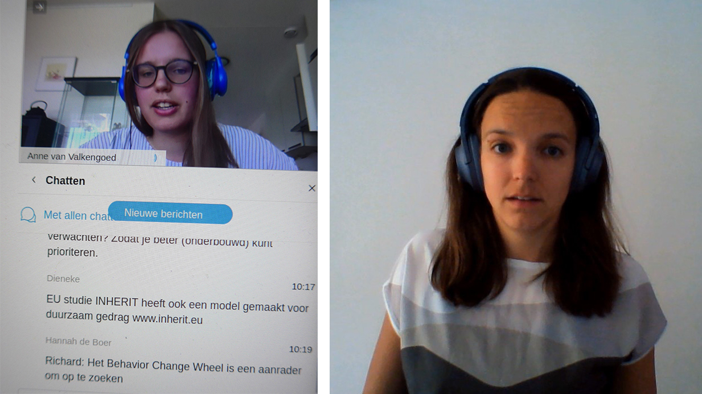

<h3> Hoe stimuleer je klimaatbewust gedrag? </h3>

Het Behavioral Insights Team (BIT) van IenW bestaat uit teamleden met een achtergrond in de gedragssociologie, -psychologie en – economie. Het team werkt vanuit een aantal prioritaire werkpakketten, zoals groene mobiliteit en klimaatadaptatie. De rol van het BIT binnen het ministerie is om doormiddel van gedragsinzichten bij te dragen aan effectief beleid. De deelnemers aan de BIT Bühne zijn beleidsmedewerkers van IenW en de uitvoeringsorganisaties van IenW. 

Met de presentatie van Jantsje Mol tijdens deze kregen de deelnemers inzicht in waarom mensen zich niet voorbereiden op overstromingen. Daarnaast gaf Jantsje op basis van economische (lab) experimenten aan welke (financiële) prikkels het beste werken om mensen te motiveren om maatregelen te nemen. Voor de deelnemers was deze presentatie een verdieping op een eerdere presentatie over kansrijke gedragsinterventies.
De laatste tijd is er een toenemende belangenstelling bij beleid in hoe gedragsinzichten kunnen bijdragen aan effectieve beleidsmaatregelen ten aanzien van klimaatadaptatie. Het gaat dan om onderwerpen als drinkwaterbesparing, zeespiegelstijging en klimaatadaptieve maatregelen genomen door specifieke doelgroepen zoals het MKB. Door het schetsen van het theoretische kader en hoe een labexperiment is ingericht, krijgt beleid meer feeling met het inschatten wat het effect is van het betrekken van gedragsinzichten bij de beleidsvorming. Dit helpt het BIT weer in het opzetten en laten uitvoeren van gedragsanalyses en experimenteerruimte voor gedragsinterventies.

Link naar de slides van <a href="bit-anne.pdf" target="_blank">Anne van Valkengoed</a>, omgevingspsychologie, RUG. 
Link naar de slides van <a href="bit-jantsje.pdf" target="_blank">Jantsje Mol</a>, gedragseconomie, VU Amsterdam. 

